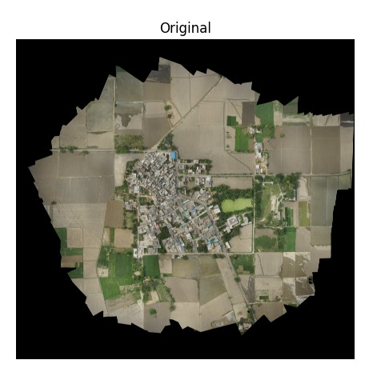
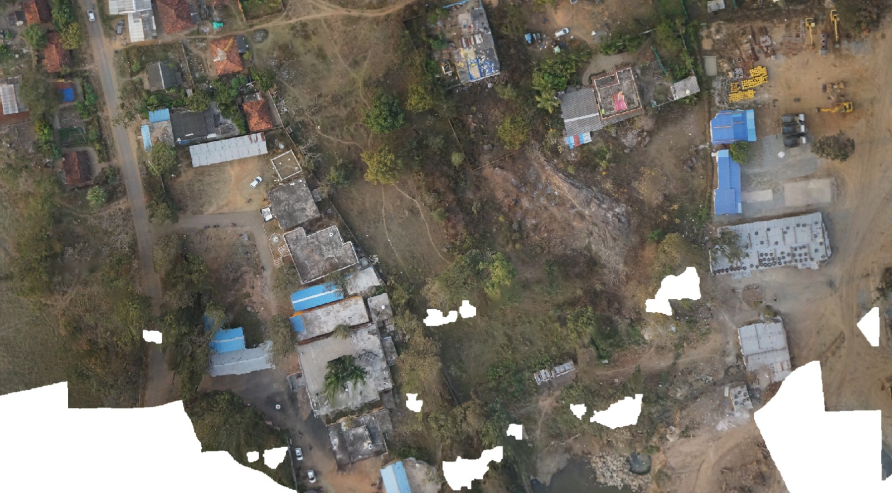
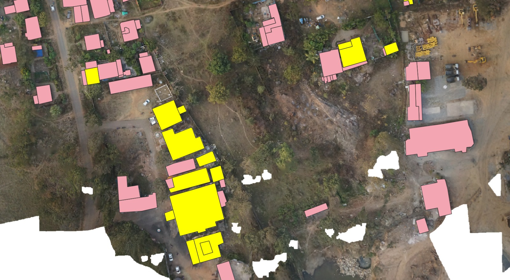
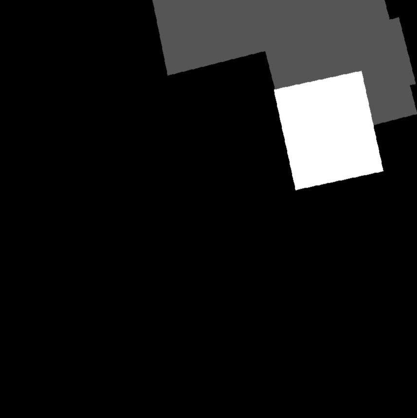
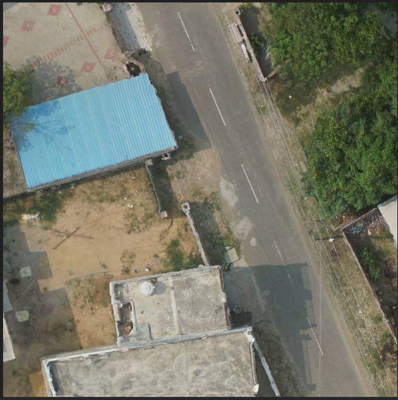
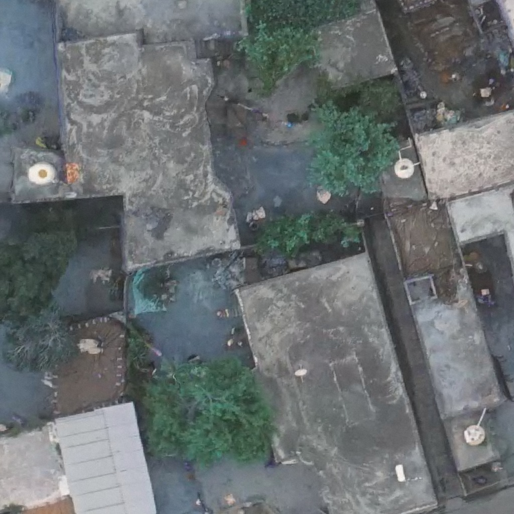
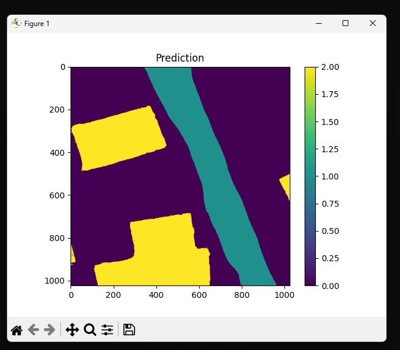

# README.md

---

# Multi-Class Geospatial Semantic Segmentation using DeepLabV3+

## Infrastructure Mapping from Satellite Orthophotos using Deep Learning and GIS Integration



---

## Project Overview

This project focuses on automated infrastructure mapping from high-resolution satellite orthophotos using deep learning-based semantic segmentation.

A complete geospatial AI pipeline was developed to identify and segment:

* Roads
* Roofs
* Water Bodies
* Utility Regions

The system includes preprocessing, dataset preparation, semantic segmentation, tiled inference, stitching & reconstruction, post-processing, visualization, and GIS-compatible GeoJSON export.

In addition to the main segmentation model, a secondary roof-type segmentation model was developed to classify roofs into:

* RCC Roofs
* Tiled Roofs
* Asbestos Roofs

The project was developed as part of a geospatial deep learning challenge and demonstrates an end-to-end AI workflow for infrastructure extraction from aerial imagery.

---

# Pipeline Overview

```text
Orthophoto Imagery
        ↓
Data Cleaning & Alignment
        ↓
Mask Generation
        ↓
Tile Creation (1024×1024)
        ↓
DeepLabV3+ Training
        ↓
Tile-wise Inference
        ↓
Stitching & Reconstruction
        ↓
Post Processing
        ↓
GeoJSON Export
        ↓
GIS Visualization
```

---

# Dataset Preparation

High-resolution orthophoto imagery was collected and standardized into a common coordinate reference system.

The dataset preparation pipeline included:

* Orthophoto preprocessing
* Raster-vector alignment
* Shapefile rasterization
* Mask generation
* Tile creation
* Data cleaning
* Background filtering

### Sample Orthophoto Tile



Caption:

> Example orthophoto tile used for roof extraction and infrastructure mapping.

---

# Roof Annotation Dataset

A dedicated roof segmentation dataset was created for roof-type classification.

The roof categories include:

| Class ID | Roof Type  |
| -------- | ---------- |
| 0        | Background |
| 1        | RCC        |
| 2        | Tiled      |
| 3        | Asbestos   |

### Annotated Roof Dataset



Caption:

> Ground truth roof annotations used for training the roof-type segmentation model.

---

# Mask Generation

Polygon annotations were converted into raster masks aligned with the original orthophoto imagery.

These masks were used during model training.

### Example Mask



Caption:

> Multi-class segmentation mask generated from roof annotations.

---

# Model Architecture

## Main Segmentation Model

### Architecture

* DeepLabV3+
* MIT-B4 Encoder

### Classes

| Class ID | Class      |
| -------- | ---------- |
| 0        | Background |
| 1        | Road       |
| 2        | Roof       |
| 3        | Water      |
| 4        | Utility    |

### Training Features

* DeepLabV3+
* Multi-class segmentation
* Dice Loss
* Cross Entropy Loss
* Focal Loss
* Data Augmentation
* Gradient Clipping
* Tiled Training
* Checkpoint Recovery

---

## Roof-Type Segmentation Model

A secondary DeepLabV3+ model was trained for fine-grained roof classification.

### Roof Classes

| Class ID | Class      |
| -------- | ---------- |
| 0        | Background |
| 1        | RCC        |
| 2        | Tiled      |
| 3        | Asbestos   |

### Improvements Applied

* Balanced Sampling
* Minority Class Emphasis
* Augmentation Pipeline
* Fine-tuning
* Weighted Loss Functions

---

# Training Data Examples

### Roof Sample 1



Caption:

> Example orthophoto tile extracted for roof-type segmentation.

---

### Roof Sample 2



Caption:

> Additional roof sample used during training and evaluation.

---

# Prediction Results

### Roof Segmentation Prediction



Caption:

> Prediction generated by the DeepLabV3+ roof segmentation model.

---

# Stitching & Reconstruction

Since orthophotos are extremely large, images were divided into smaller tiles for inference.

Predicted tiles were then stitched together to reconstruct the complete scene.

The reconstruction pipeline included:

* Tile tracking
* Coordinate recovery
* Boundary handling
* Reconstruction
* Overlay generation

### Full Scene Reconstruction


Caption:

> Full-scene segmentation reconstructed from tile-wise predictions.

---

# Post Processing

Post-processing was applied to improve segmentation quality.

Techniques included:

* Morphological operations
* Noise suppression
* Small region removal
* Boundary refinement
* Overlay enhancement

These steps improved the visual quality and structural consistency of predictions.

---

# GIS Export

The segmentation outputs were converted into GIS-compatible vector layers using GeoJSON export.

Exported classes include:

* Roads
* Roof Regions
* Water Bodies
* Utility Regions

The outputs can be visualized directly in:

* QGIS
* ArcGIS
* Other GIS Platforms

---

# Project Highlights

✅ Multi-Class Semantic Segmentation

✅ Roof-Type Classification

✅ DeepLabV3+ Architecture

✅ Tiled Inference Pipeline

✅ Full-Scene Reconstruction

✅ GeoJSON Export

✅ GIS Integration

✅ Post-Processing Pipeline

✅ Large Orthophoto Handling

---

# Technology Stack

### Deep Learning

* PyTorch
* Segmentation Models PyTorch

### Computer Vision

* OpenCV
* NumPy

### Geospatial Processing

* Rasterio
* GeoJSON
* QGIS

### Visualization

* Matplotlib

---

# Repository Structure

```text
geospatial-semantic-segmentation/
│
├── README.md
├── report.pdf
├── presentation.pptx
│
├── assets/
│   ├── dataset_examples/
│   ├── annotations/
│   ├── predictions/
│   ├── reconstruction/
│   └── overlays/
│
├── code_samples/
│   ├── inference.py
│   ├── evaluation.py
│   ├── geojson_export.py
│   └── stitching.py
│
└── docs/
```

---

# Future Work

### Knowledge Distillation

Train lightweight student models using the current DeepLabV3+ model as a teacher network to enable faster deployment.

### Improved Roof Classification

Further improve tiled and asbestos roof detection through advanced sampling strategies.

### Test-Time Augmentation

Integrate TTA for more robust predictions.

### Edge Deployment

Optimize the segmentation pipeline for lightweight GIS and mobile applications.

### Advanced GIS Integration

Direct integration with spatial databases and web-GIS platforms.

---

# Dataset Availability

Dataset and trained model weights are not publicly released due to challenge and research restrictions.

The repository includes:

* Pipeline overview
* Documentation
* Visualizations
* Sample outputs
* Evaluation scripts
* GeoJSON generation utilities

---

# Author

**Jashwanth B**
B.Tech – Computer Science & Engineering
SRM Institute of Science and Technology

---
